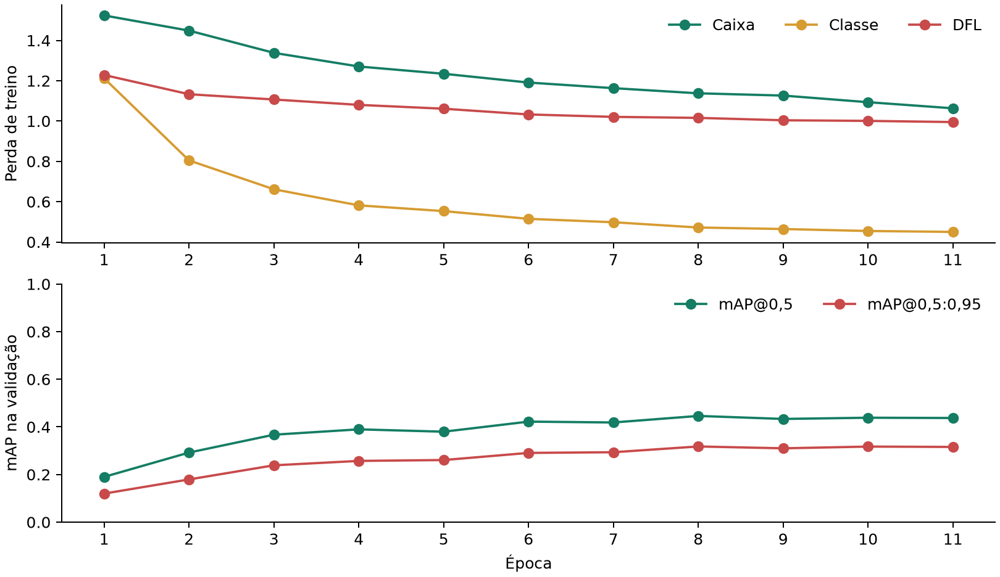
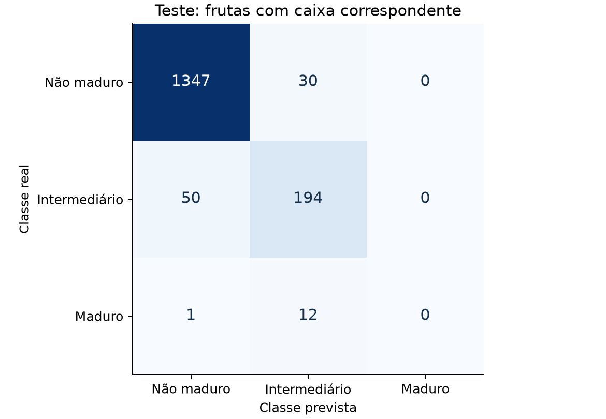
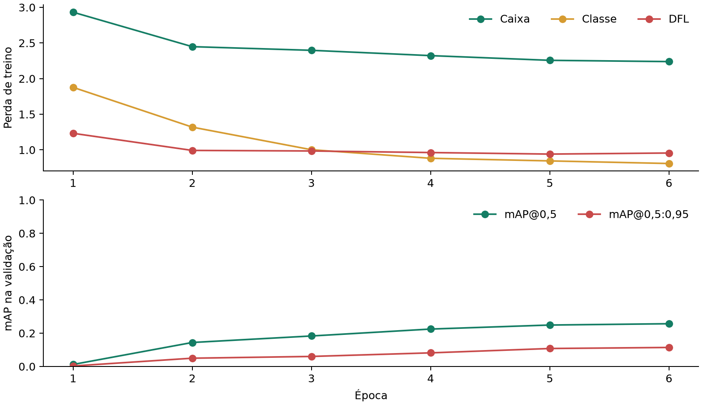
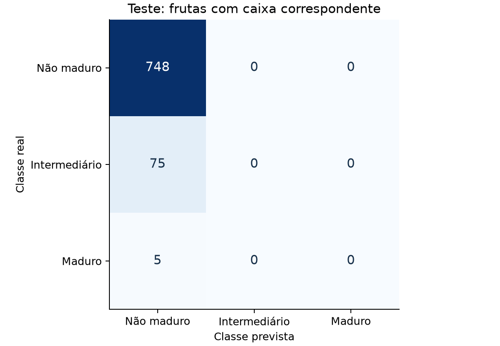

# Fruit Harvest Vision

A small, reproducible computer vision project for detecting tomatoes on plants, estimating ripeness, and recommending whether to harvest each detected fruit. This repository covers the vision software. It does not move a robotic arm.

## What the system does

1. Converts annotated greenhouse images into a three-class YOLO dataset with disjoint image splits.
2. Fine-tunes a pretrained YOLO11 nano detector on CPU with AdamW, cosine learning-rate decay, and class-weighted classification loss.
3. Measures detection quality and selects a harvest confidence threshold on validation images when the model finds ripe fruit correctly.
4. Evaluates the selected threshold once on held-out test images, or reports detection metrics without a harvest decision.
5. Exports PyTorch weights, ONNX, and a manifest describing the inference contract.

The classes are `unripe`, `semi_ripe`, and `ripe`. The policy returns `harvest` only for a `ripe` detection at or above the selected threshold. All other detections return `wait`. A missing detection produces no harvest command.

## Hardware and setup

The default configuration targets a laptop with an Intel Iris Xe GPU, 15 GiB RAM, and CPU-only PyTorch. Training is capped at two hours by the Ultralytics `time` setting. That is a time budget, not a promised accuracy level. The source images contain small fruits; a larger input size may improve recall but will train more slowly.

```bash
python3 -m venv .venv
.venv/bin/pip install torch torchvision --index-url https://download.pytorch.org/whl/cpu
.venv/bin/pip install -e .
source .venv/bin/activate
```

The source images, annotations, prepared datasets, checkpoints, and experiment records are included. See [Dataset](docs/dataset.md) for provenance, licenses, labels, and preparation. The current AerialYield experiment considers only `Red` (>90% red) ripe enough for harvest; `Light Red` remains `semi_ripe`.

## Run the pipeline

For the current AerialYield-T2M experiment:

```bash
fruit-harvest train --data data/aerial-processed/dataset.yaml \
  --config configs/aerial-cpu-highres.yaml --name aerial-adamw-highres

fruit-harvest evaluate --split val \
  --weights artifacts/runs/aerial-adamw-highres/weights/best.pt \
  --data data/aerial-processed/dataset.yaml --config configs/aerial-cpu-highres.yaml \
  --output artifacts/evaluation/aerial-highres-validation

fruit-harvest evaluate --split test --detection-only \
  --weights artifacts/runs/aerial-adamw-highres/weights/best.pt \
  --data data/aerial-processed/dataset.yaml --config configs/aerial-cpu-highres.yaml \
  --output artifacts/evaluation/aerial-test
```

The prepared data and checkpoints are ready after cloning; downloading and preparing them again is optional. The [source split audit](output/aerial/metrics/source_split_audit.json) explains why the AerialYield YOLO folders must be filtered by the official COCO split lists. Three CPU profiles were compared on validation only; [the selection record](output/aerial/metrics/validation_comparison.json) identifies the 512 px checkpoint. Validation found no correct `ripe` harvest decision, so the test command uses `--detection-only`. See [Reporting](docs/reporting.md) for the report commands.

The earlier AgRobTomato workflow remains available:

For the AgRobTomato Pascal VOC archive, download, verify, extract, and prepare it with:

```bash
fruit-harvest data fetch-agrob

fruit-harvest data prepare --format voc \
  --root data/raw/Dataset-Greenhouse_Tomato_AgRob \
  --output data/agrob-processed

fruit-harvest train \
  --data data/agrob-processed/dataset.yaml \
  --name agrob-yolo11n

fruit-harvest export \
  --weights artifacts/runs/agrob-yolo11n/weights/best.pt \
  --output artifacts/model-candidate

fruit-harvest evaluate \
  --weights artifacts/model-candidate/model.onnx \
  --data data/agrob-processed/dataset.yaml \
  --split val --output artifacts/evaluation/validation

fruit-harvest evaluate \
  --weights artifacts/model-candidate/model.onnx \
  --data data/agrob-processed/dataset.yaml \
  --split test --policy artifacts/evaluation/validation/policy.json \
  --output artifacts/evaluation/test

fruit-harvest export \
  --weights artifacts/runs/agrob-yolo11n/weights/best.pt \
  --onnx artifacts/model-candidate/model.onnx \
  --policy artifacts/evaluation/validation/policy.json \
  --output artifacts/model-v1

fruit-harvest predict --bundle artifacts/model-v1 \
  --image path/to/tomato.jpg --output artifacts/prediction.json
```

Validation writes `policy.json` only after a correct `ripe` detection. If it reports `unavailable_no_ripe_true_positives`, the final export must wait for a better model or dataset.

Use `--backend pt` with `predict` to compare the PyTorch checkpoint to the default ONNX backend. The command also accepts a directory of `.jpg`, `.jpeg`, or `.png` images.

The original tomatOD annotations are COCO-compatible. When those files become available, prepare them with:

```bash
fruit-harvest data prepare --format coco \
  --images data/raw/tomatod/images \
  --train-coco data/raw/tomatod/train.json \
  --test-coco data/raw/tomatod/test.json \
  --output data/tomatod-processed
```

The COCO file names are examples; point the flags to the actual extracted files. The source test split is preserved, and validation is selected only from its training images.

## Source and dependency licenses

AerialYield-T2M is released under [CC BY 4.0](https://zenodo.org/records/22071809/files/LICENSE?download=1). AgRobTomato is cited in [Dataset](docs/dataset.md); the official Zenodo API records CC BY 4.0. The original and prepared images are distributed with [attribution](data/README.md). The original tomatOD source states CC BY-NC-SA 4.0; its images are not included. Ultralytics distributes its software and models under AGPL-3.0 or a separate enterprise license; review those terms before deploying or distributing a derivative system. The experiment checkpoints are included for reproducibility, without a validated harvest policy.

## Repository map

| Path | Responsibility |
| --- | --- |
| `configs/*.yaml` | Training budget, optimization settings, split seed, and matching thresholds |
| `src/fruit_harvest/data/` | Source annotation adapters, validation, and YOLO conversion |
| `src/fruit_harvest/model.py` | Narrow Ultralytics adapter for training and prediction |
| `src/fruit_harvest/evaluation.py` | Validation and test orchestration, harvest policy selection |
| `src/fruit_harvest/metrics.py` | Spatial matching and harvest counts independent of model code |
| `src/fruit_harvest/decision.py` | Decision policy independent of model internals |
| `src/fruit_harvest/exporting.py` | Versioned `.pt` and `.onnx` bundle with checksums |
| `src/fruit_harvest/contract.py` | Stable result types for a future robot controller |
| `src/fruit_harvest/cli.py` | Reproducible user commands |
| `scripts/` | Source split audit, licensed visual examples, and PDF/chart generation |
| `output/` | Published metric snapshots, figures, examples, and PDF reports |
| `data/` | Attributed source images, annotations, and prepared YOLO splits |
| `artifacts/` | Recorded training runs, checkpoints, ONNX export, and evaluations |
| `docs/` | Architecture, data provenance, and experiment guidance |

Read [Architecture](docs/architecture.md) for the contracts and [Experiments](docs/experiments.md) for metrics and interpretation.

The project owner defined the goal and scope; implementation and the initial experiments received assistance from OpenAI Codex. The work is not presented as code written entirely by one person.

The [reproducible report guide](docs/reporting.md) explains how to regenerate the public PDF, charts, and metric snapshots from the recorded CPU experiment. It also explains why a high matched-fruit accuracy does not mean the harvest decision is reliable.

## Current AerialYield result

The [AerialYield technical report](output/aerial/pdf/relatorio_tecnico_tomates.pdf) presents the split, three training profiles, curves, class balance, per-class metrics, confusion matrix, and [licensed visual examples](output/aerial/examples/ATTRIBUTION.md). The source has 677 unique images; the processed split is 477/105/95 images. Only `Red` (>90% red) maps to `ripe`.

The selected 11-epoch, 512 px CPU checkpoint reached **80.0% detection precision**, **40.1% detection recall**, and **47.4% mAP@0.5** on the 95-image held-out test split. Accuracy among 1,634 matched fruits was **94.3%**, but macro F1 was **59.3%** and **none of the 13 matched ripe fruits were classified as ripe**. One additional ripe fruit was missed. The model does **not** provide a validated harvest recommendation. The [checkpoint](artifacts/runs/aerial-adamw-highres/weights/best.pt), [metric snapshots](output/aerial/metrics/), and [graphs](output/aerial/figures/) are available for inspection and replay.





[Correct prediction](output/aerial/examples/correct.jpg) · [Incorrect ripe prediction](output/aerial/examples/incorrect.jpg). Both images are crops from the held-out test split; [attribution and changes](output/aerial/examples/ATTRIBUTION.md) are documented.

## Earlier AgRob CPU smoke run

The published [technical report](output/pdf/relatorio_tecnico_tomates.pdf) and [metric JSON/CSV files](output/metrics/) record a six-epoch verification run. On the 90-image held-out test split, aggregate detection precision was **56.2%**, recall **32.8%**, and mAP@0.5 **25.7%**. Matched-fruit classification accuracy was **90.3%**, but macro F1 was only **31.6%**: all five ripe test fruits with matched boxes were called `unripe`. No validated harvest policy exists for this checkpoint.





The [correct example](output/examples/correct.jpg) and [incorrect example](output/examples/incorrect.jpg) show individual fruit boxes from the held-out AgRob test split. Green is the original annotation; orange is the model prediction. Image credit and changes are documented in [ATTRIBUTION.md](output/examples/ATTRIBUTION.md).
